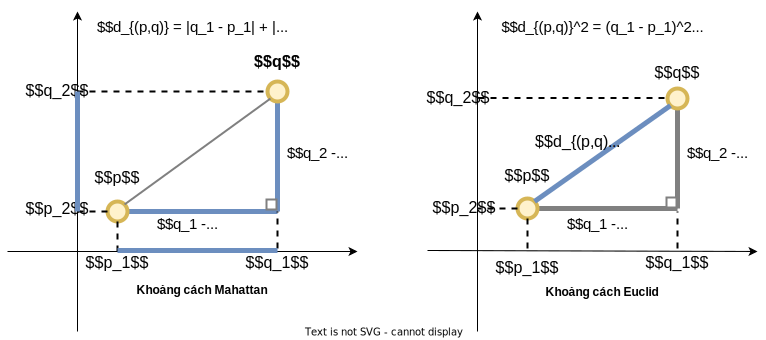
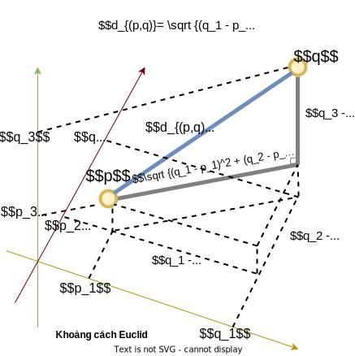

# A* Search - Thuật toán tìm kiếm A*

## I. Tóm tắt

Thuật toán tìm kiếm A* được công bố đầu tiên bởi Nils Nilsson và Peter Hart vào năm 1968.

Nó được sử dụng trong việc tìm đường đi và đi qua một đồ thị.

Nó có thể là phương pháp tốt nhất nếu đồ thị không thể được xử lý trước và không có hạn chế về bộ nhớ.

Thông thường thì phương pháp tìm đường đi ngắn nhất của Dijkstra là phương pháp tốt nhất **nhưng thuật toán Dijkstra phải xem xét tất cả các nốt của đồ thị**.

Thuật toán Dijkstra có thể thực hiện việc tiền xử lý đồ thị và tạo nên một cây đường đi ngắn nhất (shortest path tree). 
Sau khi tạo ra cây đường đi ngắn nhất này rồi thì cơ bản việc tính đường đi ngắn nhất sẽ nhanh và dễ. 

Thậm chí thuật toán Dijkstra xét cả các nốt cực kỳ xa so với nốt đích cần tìm. 
Chính trong trường hợp này mà thuật toán A* có thể vượt trội hơn thuật toán Dijkstra vì A* chỉ xem xét các nốt gần đích.

### Thuật toán A*

- Mục đích của thuật toán tìm kiếm A* là hướng dẫn hướng đi tổng quát của thuật toán tìm kiếm.
- Vì vậy ta có thể loại bỏ những kiểm tra và những trạng thái không cần thiết.
- Tìm kiếm A* sử dụng thuật giải heuristic (tự khám phá)
- Heuristic là một kỹ thuật nhằm giải quyết một vấn đề cách nhanh chóng khi những phương pháp cổ điển là quá chậm hoặc nhằm tìm ra một giải pháp tương đối khi những phương pháp cổ điển không tìm ra được bất kỳ một lời giải chính xác nào.

### Hàm heuristic

**f(x) = g(x) + h(x)**

- Thuật toán A* đi bước kế tiếp tùy theo hàm giá trị chi phí f(x) này : chi phí càng thấp càng tốt.

- g(x) là chi phí để đi từ điểm khởi đầu đến điểm x.
- h(x) là chi phí tương đối (heuristic estimate) đi từ x đến điểm đích. h(x) bản thân nó là hàm heuristic.
- Ta không biết được khoảng cách thực sự đến điểm đích vì có thể có chướng ngại vật trên đường đi.

### Trường hợp không có hàm heuristic

- Trong trường hợp hàm chi phí là **f(x) = g(x)**
- Trường hợp này ta không xét đến heuristic, tức ta sẽ lấy chuyển động có chi phí thấp nhất kể từ điểm khởi đầu đến điểm hiện tại.
- Đây chính xác là cách hoạt động của các thuật toán đường đi ngắn nhất như thuật toán Dijkstra.
- Hàm heuristic là ưu điểm chính của thuật toán A*

### Xây dựng hàm heuristic

Xây dựng một hàm heuristic h(x) tốt là thiết yếu.
1. Hàm heuristic h(x) là chấp nhận được nếu nó không đánh giá quá lố khoảng cách giữa trạng thái x và đích đến. Khi hàm heuristic h(x) là chấp nhận được thì nó luôn tạo ra giải pháp tối ưu. Và nó luôn tìm ra đường đi ngắn nhất giữa điểm khởi đầu và điểm đích.
2. Hàm heuristic h(x) là nhất quán nếu với mỗi hai nốt lân cận nhau thì ta có c(A+B) + h(B) >= h(A) trong đó c(A+B) là trọng lượng của cung giữa đỉnh A và đỉnh B. Nếu một hàm heuristic h(x) là nhất quán thì nó cũng có thể chấp nhận được.

## II. Một số hàm heuristic

Hai hàm heuristic quan trọng nhất là hàm khoảng cách Manhattan (Manhattan-distance) và hàm khoảng cách Euclid (Euclidean-distance).

### 1. Hàm khoảng cách Manhattan


Đối với hàm khoảng cách Manhattan, trong không gian hai chiều, ta phải tính khoảng cách trên trục ngang và trục dọc, rồi tính tổng các giá trị này.

Nếu ta có hai điểm p có tọa độ (p1,p2) và q có tọa độ (q1,q2) trong không gian thực hai chiều như trên hình vẽ, thì khoảng cách Manhattan d(p,q) giữa hai điểm này là tổng giá trị tuyệt đối của hiệu số của các tọa độ của hai điểm này.

**d(p,q) = |q1 - p1| + |q2 - p2|**

Trong không gian thực n chiều, khoảng cách Manhattan giữa hai điểm p = (p1,p2,....,pn) và q = (q1,q2,...,qn) là tổng chiều dài của các hình chiếu của đoạn thẳng giữa hai điểm này lên các trục tọa độ.

Công thức tính khoảng cách Manhattan **d(p,q)** :


Dưới đây là hình minh họa cách tính khoảng cách Manhattan và khoảng cách Euclid giữa hai điểm p = (p1,p2) và q = (q1,q2) trong không gian hai chiều:



### 2. Hàm khoảng cách Euclid

Khoảng cách Euclid giữa hai điểm là độ dài đoạn thẳng nối hai điểm đó.

Trong không gian hai chiều, cho hai điểm p có tọa độ (p1,p2) và q có tọa độ (q1,q2). Khi đó khoảng cách giữa p và q được tính bằng công thức sau:


Theo định lý Pitago, trong một tam giác vuông ta có bình phương của cạnh huyền bằng tổng bình phương của hai cạnh còn lại. 

Công thức tính khoảng cách Euclid trên được suy ra bằng cách áp dụng định lý Pitago cho một tam giác vuông có hai cạnh góc vuông song song với hai trục tọa độ và cạnh huyền là đoạn thẳng nối hai điểm p và q như ở hình vẽ trên.

Trong không gian ba chiều, cách tính khoảng cách Euclid giữa hai điểm p = (p1,p2,p3) và q = (q1,q2,q3) được minh họa trong hình dưới đây:



Tổng quát, trong không gian n chiều, khoảng cách giữa hai điểm p = (p1,p2,....,pn) và q = (q1,q2,...,qn) được tính bằng công thức sau:


### 3. Bảng tóm tắt

| Khoảng cách Manhattan                                                                     | Khoảng cách Euclid                                        |
|-------------------------------------------------------------------------------------------|-----------------------------------------------------------|
| Nó là tổng chiều dài của các hình chiếu của đoạn thẳng giữa hai điểm lên các trục tọa độ. | Nó chính là độ dài đoạn thẳng nối hai điểm                |
| Ta có thể tính hàm này nhanh chóng                                                        | Không phải lúc nào cũng hiệu quả vì phải tính căn bậc hai |
| Hàm này không chấp nhận được - Nó có khuynh hướng ước lượng quá lố khoảng cách            | Hàm này chấp nhận được làm một hàm heuristic h(x)         |

## III. Minh họa thuật toán tìm kiếm A*

https://qiao.github.io/PathFinding.js/visual/

## III. Code Java

Vertex.java
````
import java.util.ArrayList;
import java.util.List;

public class Vertex {
    private String name;
    private double x;
    private double y;

    // parameters for the A* search
    private double g;
    private double h;
    private double f;
    // track the adjacent list (neighbors)
    private List<Edge> adjacentList;
    // it tracks the previous vertex in the shortest path
    private Vertex parent;
    
    public Vertex(String name, double x, double y) {
        this.name = name;
        this.x = x;
        this.y = y;
        this.adjacentList = new ArrayList<>();
    }
    
    public double getX() {
        return x;
    }

    public void setX(double x) {
        this.x = x;
    }

    public double getY() {
        return y;
    }

    public void setY(double y) {
        this.y = y;
    }

    public double getG() {
        return g;
    }

    public void setG(double g) {
        this.g = g;
    }

    public double getH() {
        return h;
    }

    public void setH(double h) {
        this.h = h;
    }

    public double getF() {
        return f;
    }

    public void setF(double f) {
        this.f = f;
    }

    public List<Edge> getAdjacentList() {
        return adjacentList;
    }

    public void addNeighbors(List<Edge> neighbors) {
        this.adjacentList.addAll(neighbors);
    }

    public Vertex getParent() {
        return parent;
    }

    public void setParent(Vertex parent) {
        this.parent = parent;
    }

    @Override
    public String toString() {
        return name;
    }
}
````

VertexComparator.java
````
import java.util.Comparator;

public class VertexComparator implements Comparator<Vertex> {

    // vertex1 is smaller than vertex2 if vertex1.f < vertex2.f (f=g+h)
    @Override
    public int compare(Vertex vertex1, Vertex vertex2) {
        return Double.compare(vertex1.getF(), vertex1.getF());
    }
}

````

Edge.java
````
public class Edge {
    private double weight;
    private Vertex target;

    public Edge(double weight, Vertex target) {
        this.weight = weight;
        this.target = target;
    }

    public double getWeight() {
        return weight;
    }

    public Vertex getTarget() {
        return target;
    }

}
````

AStarSearch.java
````
import java.util.*;

public class AStarSearch {
    private Vertex source;
    private Vertex destination;

    private Set<Vertex> exploredVertices;
    private PriorityQueue<Vertex> queue;

    public AStarSearch(Vertex source, Vertex destination) {
        this.source = source;
        this.destination = destination;
        this.exploredVertices = new HashSet<>();
        this.queue = new PriorityQueue<>(new VertexComparator());
    }

    public void run() {
        queue.add(source);

        while (!queue.isEmpty()) {
            // we always get the vertex with the lowest f(x) value possible
            Vertex current = queue.poll();
            exploredVertices.add(current);

            // we have found the destination vertex
            if (current == destination) {
                break;
            }

            // consider the adjacent vertices
            for (Edge edge : current.getAdjacentList()) {
                Vertex child = edge.getTarget();
                double cost = edge.getWeight();
                double tempG = current.getG() + cost;
                double tempF = tempG + heuristic(current, destination);

                // if we have considered the child and the f(x) is higher
                if (exploredVertices.contains(child) && tempF >= child.getF()) {
                    continue;
                }
                // if we have not visited the child and the f(x) is lower
                else if (!queue.contains(child) || tempF < child.getF()) {
                    // this is how we can track the shortest path (predecessor)
                    child.setParent(current);
                    child.setG(tempG);
                    child.setF(tempF);

                    // if we have it in the queue, but now we have a lower value
                    // instead of update, we remove and reinsert it
                    if (queue.contains(child)) {
                        queue.remove(child);
                    }
                    queue.add(child);
                }
            }
        }
    }

    private double heuristic(Vertex current, Vertex destination) {
        return Math.sqrt(Math.pow(current.getX() - destination.getX(), 2) +
                Math.pow(current.getY() - destination.getY(), 2));
    }

    public void printSolutionPath() {
        List<Vertex> path = new ArrayList<>();

        for(Vertex vertex = destination; vertex != null; vertex = vertex.getParent()) {
            path.add(vertex);
        }

        Collections.reverse(path);
        System.out.println(path);
    }
}
````

Main.java
````
import java.util.List;

public class Main {
    public static void main(String[] args) {

        Vertex vertexA = new Vertex("A", 0, 0);
        Vertex vertexB = new Vertex("B", 10, 20);
        Vertex vertexC = new Vertex("C", 20, 40);
        Vertex vertexD = new Vertex("D", 30, 10);
        Vertex vertexE = new Vertex("E", 40, 30);
        Vertex vertexF = new Vertex("F", 50, 10);
        Vertex vertexG = new Vertex("G", 50, 40);

        vertexA.addNeighbors(List.of(new Edge(10, vertexB), new Edge(50, vertexD)));
        vertexB.addNeighbors(List.of(new Edge(10, vertexC), new Edge(20, vertexD)));
        vertexC.addNeighbors(List.of(new Edge(10, vertexE), new Edge(30, vertexG)));
        vertexD.addNeighbors(List.of(new Edge(80, vertexF)));
        vertexE.addNeighbors(List.of(new Edge(50, vertexF), new Edge(10, vertexG)));
        vertexG.addNeighbors(List.of(new Edge(10, vertexF)));

        AStarSearch aStarSearch = new AStarSearch(vertexA, vertexF);
        aStarSearch.run();
        aStarSearch.printSolutionPath();
    }
}
````
