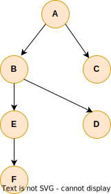

# Breadth-First Search (BFS) : Tìm kiếm theo chiều rộng

## I. Tóm tắt



Có đồ thị G(V,E) và mục đích là đi đến từng đỉnh V đúng một lần.

Breadth-First Search đi đến các đỉnh lân cận và các đỉnh lân cận của các đỉnh mới này cho đến khi tất cả các nút đều được đi đến.

- Độ phức tạp khi chạy thuật toán là O(V+E).
- Độ phức tạp về bộ nhớ thì không thuận lợi vì ta phải lưu trữ nhiều tham chiếu (references).


### Giải thích

Ta đi đến mỗi đỉnh đúng một lần, vì những đỉnh (V) này nối với nhau bởi các cạnh (E) nên ta cũng phải đi qua các cạnh.

Do đó, độ phức tạp của thuật toán là O(V+E) : V là số lượng các đỉnh (vertices), E là số lượng các cạnh (edges).

Vậy Tìm kiếm theo chiều rộng (BFS) có độ phức tạp tuyến tính.

Ta phải định đỉnh khởi đầu, trong trường hợp này là đỉnh A. Ta phải đi đến mọi đỉnh lân cận với nó, ở đây là đỉnh B và C. Vậy ta phải đi đến hai điểm này và những đỉnh lân cận với chúng. Ta phải đảm bảo rằng ta sẽ không đi đến một đỉnh đã từng được ghé qua rồi. Vậy ta sẽ đến đỉnh D, rồi đỉnh E và F.


### Ưu và khuyết điểm

Vì Breadth-First Search (BFS) cần nhiều bộ nhớ, thông thường thuật toán Depth-First Search (DFS) được ưu tiên.

BFS có một số ứng dụng, nhưng trong trường hợp có thể dùng BFS và DFS thì DFS được ưu tiên dùng do tốn ít bộ nhớ hơn.

BFS có ưu điểm là nó tạo một đường đi ngắn nhất. Thuật toán Dijkstra chủ yếu dùng BFS khi tất cả các cạnh có trọng số bằng 1.

BFS dựa chủ yếu vào kiểu dữ liệu trừu tượng hàng đợi (queue).


## II. Thuật toán

### Breadth-First Search

````
bfs(vertex):
	Queue queue
	set vertex to be visited
	queue.add(vertex)

	while queue not empty
		actual = queue.dequeue()

		for v in actual neighbors
			if v is not visited
				set v visited
			queue.add(v)
````

### Giải thích

Thuật toán này sử dụng kiểu dữ liệu trừu tượng hàng đợi (queue) FIFO (first in first out)

Ban đầu ta có hàng đợi rỗng và ta kiểm tra xem ta có từng đi qua nốt này hay chưa.

Thuật toán kết thúc khi không còn nốt nào trong hàng đợi nữa.


## III. Code Java

Vertex.java
````java
import java.util.ArrayList;
import java.util.List;

public class Vertex {
    private String name;
    private boolean visited;
    private List<Vertex> adjacentList;

    public Vertex(String name) {
        this.name = name;
        this.adjacentList = new ArrayList<>();
    }

    public boolean isVisited() {
        return visited;
    }

    public void setVisited(boolean visited) {
        this.visited = visited;
    }

    public List<Vertex> getAdjacentList() {
        return adjacentList;
    }

    public void addNeighbors(List<Vertex> neighbors) {
        this.adjacentList.addAll(neighbors);
    }

    @Override
    public String toString() {
        return this.name;
    }
}
````

BreadthFirstSearch.java
````java
import java.util.LinkedList;
import java.util.Queue;

public class BreadthFirstSearch {
    public void traverse(Vertex root) {
        Queue<Vertex> queue = new LinkedList<>();

        root.setVisited(true);
        queue.add(root);

        while (!queue.isEmpty()) {
            Vertex actualVertex = queue.remove();
            System.out.println("Actual visited vertex : " + actualVertex);

            for (Vertex vertex : actualVertex.getAdjacentList()) {
                if (!vertex.isVisited()) {
                    vertex.setVisited(true);
                    queue.add(vertex);
                }
            }
        }
    }
}
````

Main.java
````java
import java.util.List;

public class Main {
    public static void main(String[] args) {
        BreadthFirstSearch breadthFirstSearch = new BreadthFirstSearch();

        Vertex a = new Vertex("A");
        Vertex b = new Vertex("B");
        Vertex c = new Vertex("C");
        Vertex d = new Vertex("D");
        Vertex e = new Vertex("E");
        Vertex f = new Vertex("F");
        Vertex g = new Vertex("G");
        Vertex h = new Vertex("H");

        a.addNeighbors(List.of(b, f, g));
        b.addNeighbors(List.of(a, c, d));
        c.addNeighbors(List.of(b));
        d.addNeighbors(List.of(b, e));
        f.addNeighbors(List.of(a));
        g.addNeighbors(List.of(a, h));
        h.addNeighbors(List.of(g));

        breadthFirstSearch.traverse(a);
    }
}
````

[Xem ở đây](../../implementation/breadth_first_search/src)

## IV. Ứng dụng

### Trong thuật toán tìm đường đi (Pathfinding algorithms)
Phương pháp trí tuệ nhân tạo (máy học - machine learning) giúp robot khám phá khu vực xung quanh nó dễ dàng hơn với BFS và DFS.

### Luồng cực đại (Maximum flow)

Ta có thể tìm luồng cực đại trong một mạng có trọng số với thuật toán Edmonds-Karp dùng BFS để tìm đường tăng luồng (augmenting paths).  

### Thu gom rác trong quản lý bộ nhớ (Garbage collection)

Thuật toán Cheney dùng BFS trong việc thu gom rác bộ nhớ để duy trì các tham chiếu còn hoạt động trên bộ nhớ heap.

#### Ví dụ :

- Python dùng việc đếm tham chiếu để lưu trữ một bộ đếm để đếm xem có bao nhiêu tham chiếu đang trỏ đến một object nào đó. Nếu bộ đếm bằng không, có nghĩa là không có một tham chiếu đang hoạt động trỏ đến object đó trong bộ nhớ heap. Có nghĩa là object này có thể được thu gom bởi bộ thu gom rác và Python sẽ loại nó khỏi bộ nhớ heap.
- Còn liên quan đến Java, có một vài phiên bản của bộ thu gom rác. Nhưng có một thuật toán chuỗi dùng DFS để duy trì các tham chiếu đang hoạt động trong bộ nhớ heap khi thu gom rác. Vì các tham chiếu này hình thành đồ thị có hướng nên ta có thể dùng các phương pháp đi băng qua một đồ thị như BFS hoặc DFS.
- Trong trường hợp này, việc thu gom rác bộ nhớ hoặc những phương pháp liên quan dùng thuật toán BFS.

### Trong việc tuần tự hóa (Serialization)

Khi tuần tự hóa và khôi phục tuần tự hóa (serialization and deserialization) các cấu trúc dữ liệu dạng cây (khi thứ tự là quan trọng), thuật toán BFS cho phép cấu trúc dạng cây được tái tạo lại theo một cách thức hiệu quả.


