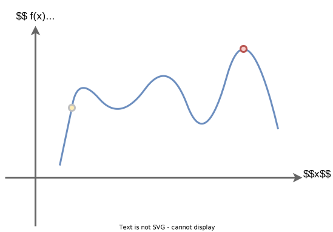

# Brute-Force Search - Tìm kiếm bằng cách vét cạn

## Tóm tắt

- Ta muốn tìm giá trị nhỏ nhất (hoặc lớn nhất) của một hàm.
- Hàm này thường được gọi là hàm chi phí (cost-function).
- Phương pháp đầu tiên được gọi là phương pháp vét cạn : ta xem xét tất cả các trạng thái có thể có lần lượt từng trạng thái một, vì vậy ta luôn tìm được một giải pháp tối ưu.
- Đây là một tiến trình cực kỳ lâu.

### Bùng nổ tổ hợp (combinatorial explosion)

Nhược điểm chính của phương pháp vét cạn là đối với nhiều bài toán trong đời thực thì số lượng các ứng viên tự nhiên nhiều đến mức không thể vét hết được.

Vì vậy việc tính toán có thể mất hàng giờ, hàng tuần, thậm chí hàng năm để có kết quả.

### Phương pháp

Xét hàm chi phí f(x) với một biến x như trong hình vẽ.

Ta chia không gian tìm kiếm (trong trường hợp này là trục **x**) thành các đoạn nhỏ **dx**.

Ta tính hàm **f(x)** ở mỗi vị trí này. Đây là một tìm kiếm tuyến tính đơn giản, trong đó ta phải xét từng trạng thái có thể có theo từng bước một.

Trước tiên ta xét điểm đầu tiên rồi sau đó ta cứ xét lần lượt "mọi trạng thái có thể". Thực ra, ta không thể xét mọi trạng thái có thể vì có vô số trạng thái. 
Ở đây, ta xét từng đoạn nhỏ dx từng bước một. Nhờ đó, ta có thể kết luận giá trị lớn nhất của hàm chi phí nằm ở đoạn có kí hiệu chấm đỏ trên đồ thị.

## Ứng dụng của việc tối ưu

### Quy hoạch toàn phương (Quadratic optimization)

Khi ta muốn tìm một giải pháp tối ưu cho bài toán thương nhân đi buôn (travelling salesman problem) hoặc bài toán định tuyến đi của xe (Vehicle routing problem) v.v

### Tài chính (Finance)

Tối ưu hóa một hàm giá trị, chẳng hạn như tính số vốn cổ phần tối ưu trong một danh mục vốn đầu tư (portfolio).

### Mạng neural (neural networks)

Các kỹ thuật tối ưu là thiết yếu khi ta làm việc với mạng thần kinh nhân tạo hoặc học sâu (deep learning).

Khi ta luyện một mạng neural, tức về bản chất ta cân chỉnh trọng số của các cung nối các neuron, để đảm bảo mạng thần kinh nhân tạo này ngày càng dự đoán tốt hơn.

Ta xây dựng một hàm cost function. Hàm này đo lường các lỗi của mạng neural. Ta muốn giảm tối đa các lỗi này, do đó dẫn đến bài toán tối ưu là tìm giá trị tối thiểu của hàm chi phí.

