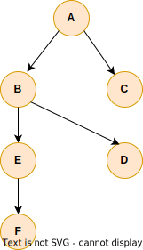
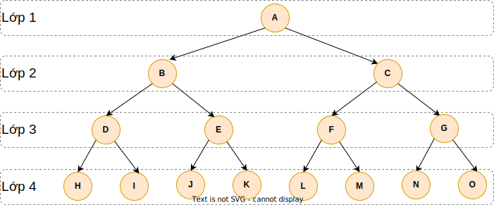

# Depth First Search (DFS) - Tìm kiếm theo chiều sâu

## I. Tóm tắt



Có đồ thị G(V,E) và mục đích là đi đến từng đỉnh V đúng một lần.

Depth-first search (DFS) đi đến xa nhất dọc theo từng nhánh trước khi quay lại và đi đến các đỉnh khác.

- Vào thế kỷ 19, nó được Trémaux nghiên cứu làm chiến lược để giải mê cung.
- Độ phức tạp khi chạy thuật toán là O(V+E).
- Độ phức tạp về bộ nhớ thì tốt hơn thuật toán Breadth-first search.


### Giải thích

Theo thuật toán này, với đồ thị ở trên thì chúng ta đi đến A rồi B, E, F rồi mới đi đến D và C.

Depth-first search đi đến xa nhất có thể trên từng nhánh trước khi quay lại để đi đến các nhánh còn lại. Vì vậy ta đi đến đỉnh F trước khi đi tới đỉnh C, là đỉnh kế cận với đỉnh khởi đầu. Đây là quy tắc cơ bản của Depth-first search.


## II. Thuật toán

### Phương pháp dùng vòng lặp

````
dfs(vertex):

	Stack stack
	stack.push(vertex)

	while stack not empty
		actual = queue.pop()
		
		if actual is not visited:
			set actual visited

			for v in actual neighbors
				stack.push(v)
````


Ta có thể lập trình thuật toán này bằng cách sử dụng kiểu dữ liệu trừu tượng ngăn xếp (stack) LIFO (last in first out) để lưu trữ các đỉnh.

Nó có độ phức tạp khi chạy thuật toán là O(V+E).

Depth-first search (DFS) đi đến xa nhất có thể dọc theo từng nhánh trước khi quay lại và đi đến các đỉnh khác.

### Phương pháp đệ quy

````
dfs(vertex):
	set vertex visited
	
	for v in vertex neighbors
		if v is not visited
			dfs(v)
````

Ta có thể lập trình thuật toán này bằng cách sử dụng kiểu dữ liệu trừu tượng ngăn xếp (stack) của bộ nhớ của hệ điều hành để lưu trữ các đỉnh.

Nó có độ phức tạp khi chạy thuật toán là O(V+E).

Depth-first search (DFS) đi đến xa nhất có thể dọc theo từng nhánh trước khi quay lại và đi đến các đỉnh khác.

## III. Code Java

Vertex.java
````java
import java.util.ArrayList;
import java.util.List;

public class Vertex {
    private String name;
    private boolean visited;
    private List<Vertex> adjacentList;

    public Vertex(String name) {
        this.name = name;
        this.adjacentList = new ArrayList<>();
    }

    public boolean isVisited() {
        return visited;
    }

    public void setVisited(boolean visited) {
        this.visited = visited;
    }

    public List<Vertex> getAdjacentList() {
        return adjacentList;
    }

    public void addNeighbors(List<Vertex> neighbors) {
        this.adjacentList.addAll(neighbors);
    }

    @Override
    public String toString() {
        return this.name;
    }
}
````

DepthFirstSearch.java
````java
import java.util.List;
import java.util.Stack;

public class DepthFirstSearch {

    private Stack<Vertex> stack;
    public DepthFirstSearch() {
        this.stack = new Stack<>();
    }
    
    public void dfs(List<Vertex> vertexList) {
        // in case we have independent clusters
        for (Vertex vertex : vertexList) {
            if (!vertex.isVisited()) {
                dsfHelper(vertex);
            }
        }
    }
    
    private void dsfHelper(Vertex vertex) {
        stack.add(vertex);
        vertex.setVisited(true);

        while (!stack.isEmpty()) {
            Vertex actualVertex = stack.pop();
            System.out.println(actualVertex);

            for (Vertex item : actualVertex.getAdjacentList()) {
                if (!item.isVisited()) {
                    item.setVisited(true);
                    stack.add(item);
                }
            }
        }
    }
}
````

DepthFirstSearchRecursive.java
````java
import java.util.List;

public class DepthFirstSearchRecursive {

    public void dfs(List<Vertex> vertexList) {
        // in case we have independent clusters
        for (Vertex vertex : vertexList) {
            if (!vertex.isVisited()) {
                vertex.setVisited(true);
                dsfHelper(vertex);
            }
        }
    }
    
    private void dsfHelper(Vertex vertex) {
        System.out.println(vertex);

        for (Vertex item : vertex.getAdjacentList()) {
            if (!item.isVisited()) {
                item.setVisited(true);
                dsfHelper(item);
            }
        }
    }
}
````

Main.java
````java
import java.util.ArrayList;
import java.util.List;

public class Main {

    public static void main(String[] args) {

        List<Vertex> vertexList = buildGraph();

        DepthFirstSearch depthFirstSearch = new DepthFirstSearch();
        depthFirstSearch.dfs(vertexList);

        vertexList = buildGraph();
        System.out.println("Run Depth First Search Recursive : ");
        DepthFirstSearchRecursive depthFirstSearchRecursive = new DepthFirstSearchRecursive();
        depthFirstSearchRecursive.dfs(vertexList);
    }
    
    private static List<Vertex> buildGraph() {
        Vertex a = new Vertex("A");
        Vertex b = new Vertex("B");
        Vertex c = new Vertex("C");
        Vertex d = new Vertex("D");
        Vertex e = new Vertex("E");
        Vertex f = new Vertex("F");
        Vertex g = new Vertex("G");
        Vertex h = new Vertex("H");

        a.addNeighbors(List.of(b, c));
        c.addNeighbors(List.of(d));
        d.addNeighbors(List.of(e));

        f.addNeighbors(List.of(g));
        g.addNeighbors(List.of(h));
        h.addNeighbors(List.of(f));

        List<Vertex> vertexList = new ArrayList<>();
        vertexList.addAll(List.of(a, b, c, d, e, f, g, h));
        return vertexList;
    }
}
````

[Xem ở đây](../../implementation/depth_first_search/src)

## IV. So sánh bộ nhớ sử dụng giữa BFS và DFS

DFS dùng ít bộ nhớ hơn BFS



### Độ phức tạp về bộ nhớ cùa thuật toán Breadth First Search

Breadth First Search dùng cấu trúc cây nhị phân (binary tree like structure) trên từng lớp. Với BFS, ta đi qua từng đỉnh lân cận, rồi đi đến đỉnh lân cận của các đỉnh vừa đi đến này v.v. 
Điều này có nghĩa là ta đi đến lớp thứ nhất rồi đến lớp thứ hai, rồi lớp thứ ba v.v.

Trong trường hợp tệ nhất, ta phải lưu trữ tất cả các nốt lá trên hàng đợi. Khi lớp cuối cùng có nhiều nốt nhất như trong đồ thị phía trên thì đó là tình huống ta phải lưu nhiều nốt nhất.

Trước hết, ta cần trả lời cho câu hỏi có bao nhiêu nốt lá trong một tìm kiếm nhị phân - tức số nốt ở lớp cuối cùng trên cây nhị phân. Trên đồ thị, lớp cuối cùng là lớp 4, và lớp này gồm có 8 nốt.

Nếu ta có N thành tố trong một cây nhị phân cân bằng thì ta có N/2 nốt lá. 

Dĩ nhiên với ký hiệu O lớn, ta không quan tâm đến hằng số, tức tuy ở đây độ phức tạp là O(N/2) thì cũng giống như O(N). Vậy đối với BFS thì độ phức tạp về bộ nhớ là tuyến tính nếu đồ thị có N thành tố.

Trong trường hợp tệ nhất, ta cần **O(N)** bộ nhớ nếu ta muốn đi hết một cây nhị phân với N thành tố bằng thuật toán Breadth First Search.


### Độ phức tạp về bộ nhớ cùa thuật toán Depth First Search

Depth First Search sẽ đi xa nhất có thể trên một nhánh.

Chẳng hạn trên một đồ thị, ta chỉ đi đến nốt lân cận ở bên trái, và ta tiếp tục đi phía bên trái này cho đến khi ta đi đến nốt lá.

Trong trường hợp tệ nhất, ta cần phải lưu trữ tất cả các nốt trên kiểu cấu trúc dữ liệu trừu tượng ngăn xếp cho tới khi ta đến được một nút lá. Sau đó, ta sẽ quay ngược trở lại và xóa nút hiện thời khỏi ngăn xếp.

Tức trong trường hợp tệ nhất, ta phải lưu trữ số nốt bằng với chiều cao của cây nhị phân. Cụ thể, trong đồ thị phía trên, độ cao của cây nhị phân là 4 (4 lớp).

Để trả lời cho câu hỏi ta phải lưu trữ bao nhiêu nốt : Nếu ta lưu **N** thành tố trong một cây nhị phân cân bằng thì logN là **chiều cao** của cây nhị phân. Tức là có **logN** nốt cho đến khi ta đi đến được nốt lá.

Vậy trong trường hợp tệ nhất, với thuật toán Depth First Search, ta cần **O(logN)** bộ nhớ nếu ta muốn đi qua hết một cây nhị phân có **N** thành tố.


### Bảng tóm tắt

| Breadth First Search                                                       | Depth First Search                                                                                      |
|----------------------------------------------------------------------------|---------------------------------------------------------------------------------------------------------|
| Trong trường hợp tệ nhất, độ phức tạp bộ nhớ là **O(N)**                   | Trong trường hợp tệ nhất, độ phức tạp bộ nhớ là **O(logN)**                                             |
| Một số thuật toán AI phụ thuộc chặt vào Breadth First Search               | Đây là lý do tại sao thuật toán này thường được ưu tiên sử dụng khi việc đi qua một đồ thị là cần thiết |
| Nó tìm những thành tố gần nó nhanh hơn (khi **đỉnh gần với nốt khởi đầu**) | Nó tìm thấy thành tố ở ngọn của nhánh nhanh hơn (khi **đỉnh ở xa nốt khởi đầu**)                        |


## V. Ứng dụng của Depth First Search

### Trong thuật toán tìm đường đi (Pathfinding algorithms)
Phương pháp trí tuệ nhân tạo (máy học - machine learning) giúp robot khám phá khu vực xung quanh nó dễ dàng hơn với BFS và DFS.


### Sắp xếp topo (Topological ordering)
Ta có thể dùng Depth First Search để tìm thứ tự topo trong một đồ thị có hướng, nó có một số ứng dụng cho : 
- Các công cụ biên dịch mã (build tools) như Maven hay Gradle, thứ tự topo của các tiến trình (process) thì cực kỳ thiết yếu.
- SCC (Strongly Connected Components) : Nhờ thứ tự topo, ta có thể tìm ra những thành phần (component) liên thông mạnh.

### Thành phần liên thông mạnh (Strongly Connected Components)
Depth First Search có thể tìm ra những thành phần liên thông mạnh của một đồ thị G(V,E) và có một số ứng dụng :
- Ta có thể phát biểu rằng những thành tố trong Thành phần liên thông mạnh là hoàn toàn giống nhau. Chẳng hạn, đây là cách mà ta có thể đề ra những video tương tự cho người dùng trên Youtube.
- Dĩ nhiên, dạng Thành phần liên thông mạnh này cũng được sử dụng với sự ra đời của học sâu (deep learning). Youtube dùng máy học (machine learning) và mạng neuron sâu (deep neutral networks) để đề ra những video mới.
- Tương tự ta cũng có thể dùng nó trong các mạng xã hội như Facebook hoặc Instagram : những người dùng thuộc về cùng một thành phần liên thông mạnh có thể có cùng một số bạn. Thông thường, Facebook sẽ đề xuất những người dùng trong một thành phần liên thông mạnh là "những người bạn có thể biết"


### Phát hiện chu trình (Cycle detection)

Depth First Search có thể phát hiện các chu trình trong một đồ thị có hướng (directed graph) G(V,E) và điều này là thiết yếu cho các hệ điều hành.

Các hệ điều hành chạy các tiến trình và các tiến trình này có thể chờ đợi nhau nên ta cần tránh deadlocks (khóa chết) khi các tiến trình này chờ đợi lẫn nhau để kết thúc nhưng chúng lại không thể thi hành được vì bị khóa. 

Trong trường hợp này, ta có thể dựng một đồ thị có hướng từ những tiến trình này với các đỉnh là các tiến trình và các cung là mối quan hệ giữa chúng. Mục đích là tránh các chu trình trong đồ thị này.


