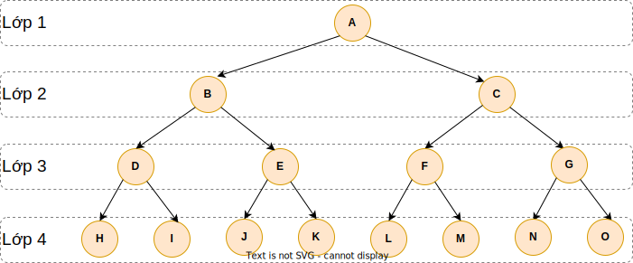

# Iterative deepening depth-first search (IDDFS) - Tìm kiếm theo chiều sâu với vòng lặp sâu

## I. Tóm tắt

Iterative deepening depth-first search (IDDFS) rất quan trọng trong trí tuệ nhân tạo và robotics

Breadth-First Search (BFS) thì tốt trong việc tìm kiếm lân cận nhưng lại rất tốn bộ nhớ vì nó lưu trữ các con trỏ và tham chiếu trong hàng đợi.

Depth-First Search (DFS) có thể được lập trình dễ dàng bằng đệ quy nhưng thuật toán này chỉ cứ luôn đi tới về phía trước. DFS tốn ít bộ nhớ.

Câu hỏi đặt ra là ta có thể xây dựng một thuật toán tìm kiếm để có thể vừa kế thừa những ưu điểm của BFS và của DFS hay không?

Câu trả lời là có, đó chính là thuật toán Iterative deepening depth-first search (IDDFS) - Tìm kiếm theo chiều sâu với vòng lặp sâu.

### Iterative deepening depth-first search (IDDFS)

- Thuật toán IDDFS đi đến các nốt trên cây tìm kiếm thì có cùng tuần tự như depth-first search nhưng việc tích tụ trật tự các nốt để đi đến trước thì lại giống breadth-first search.
- Nó cứ đi ngày càng sâu trên một cây tìm kiếm với DFS trên mỗi vòng lặp.
- Độ phức tạp về thời gian chạy thuật toán của IDDFS trên một cây cân bằng là tương tự như độ phức tạp của DFS.
- Nhược điểm : ta cứ phải tính đi tính lại cùng một bài toán, nhưng cũng không đến nỗi tệ lắm tức khoảng O(c*N) ~ O(N) nếu c là một hằng số.

### Chạy thuật toán



Ta phải định nghĩa một giới hạn độ sâu (depth bound), giới hạn này cho biết là từ nốt gốc ta sẽ đi sâu bao nhiêu lớp.

Ban đầu depth bound là 1, tức là ta sẽ chỉ đi tới nốt gốc với thuật toán DFS. Tức ta chỉ đi đến nốt A trên đồ thị.

Sau đó, ta tăng biến depth bound lên 2. Tức là ta sẽ đi đến hai lớp đầu tiên của đồ thị. Ta dùng DFS để đi đến tất cả các đỉnh của cây con này. Với đồ thị trên ta sẽ đi đến A,B,C.

Tiếp theo ta tăng giới hạn này lên 3 và ta dùng DFS khi có thể có 3 lớp. Vậy thứ tự của DFS đi đến các đỉnh của đồ thị trên với 3 lớp là A,B,D,E,C,F,G.

Một lần nữa ta lại tăng giới hạn lên 4, tức ta sẽ đi đến tất cả các đỉnh của bốn lớp đầu tiên của đồ thị. Với đồ thị trên ta sẽ đi đến A,B,D,H,I,E,J,K,C,F,L,M,G,N,O.

Như đã thấy, mỗi lần tăng giới hạn lên thì ta lại giải đi giải lại cùng một vấn đề vì ta dùng DFS cho cùng một chiều ngang và cùng chiều ngang của đồ thị con. Nhưng về cơ bản thì độ phức tạp của thời gian chạy cuối cùng cũng là tuyến tính.

Do đó với giới hạn độ sâu này, ta có thể kết hợp BFS với DFS để đi đến toàn bộ các đỉnh của một số lớp định trước. 


## III. Code Java

Vertex.java
````java
import java.util.ArrayList;
import java.util.List;

public class Vertex {
    private String name;
    private Integer depthLevel;
    private List<Vertex> adjacentList;

    public Vertex(String name) {
        this.name = name;
        this.adjacentList = new ArrayList<>();
    }

    public List<Vertex> getAdjacentList() {
        return adjacentList;
    }

    public void addNeighbors(List<Vertex> neighbors) {
        this.adjacentList.addAll(neighbors);
    }

    public Integer getDepthLevel() {
        return depthLevel;
    }

    public void setDepthLevel(Integer depthLevel) {
        this.depthLevel = depthLevel;
    }

    public String getName() {
        return name;
    }

    @Override
    public String toString() {
        return this.name;
    }
}
````

IDDFS.java
````java
import java.util.Stack;

public class IDDFS {
    // this is the vertex we are looking for
    private Vertex targetVertex;
    private boolean isTargetFound;
    private int maxLength;

    public IDDFS(Vertex targetVertex) {
        this.targetVertex = targetVertex;
    }

    public void search(Vertex root) {
        int depth = 0;
        root.setDepthLevel(0);

        while (!isTargetFound) {
            if (depth > maxLength) {
                System.out.println("The vertex is not found. Depth : " + depth + ", maxLength : " + maxLength);
                break;
            }
            System.out.println();
            System.out.print(depth + ": ");
            dfs(root, depth);
            depth++;
        }

    }

    private void dfs(Vertex source, int depthLevel) {
        Stack<Vertex> stack = new Stack<>();
        stack.push(source);

        while (!stack.isEmpty()) {
            Vertex actualVertex = stack.pop();
            System.out.print(actualVertex + " ");

            if (actualVertex.getName().equals(targetVertex.getName())) {
                System.out.println("The vertex has been found!");
                isTargetFound = true;
                return;
            }

            if (actualVertex.getAdjacentList() != null && actualVertex.getAdjacentList().size() > 0
                    && maxLength < actualVertex.getDepthLevel() + 1) {
                maxLength = actualVertex.getDepthLevel() + 1;
            }

            // IDDFS : not to go as deep as possible in the graph
            if (actualVertex.getDepthLevel() >= depthLevel) {
                continue;
            }

            // standard DFS
            for (Vertex vertex : actualVertex.getAdjacentList()) {
                if (vertex.getDepthLevel() == null) {
                    vertex.setDepthLevel(actualVertex.getDepthLevel() + 1);
                }
                stack.push(vertex);
            }
        }
    }
}
````

Main.java
````java
import java.util.List;

public class Main {
    public static void main(String[] args) {
        testFound(getVertices());
        testNotFound(getVertices());
    }

    private static Vertices getVertices() {
        Vertex a = new Vertex("A");
        Vertex b = new Vertex("B");
        Vertex c = new Vertex("C");
        Vertex d = new Vertex("D");
        Vertex e = new Vertex("E");
        Vertex f = new Vertex("F");
        Vertex g = new Vertex("G");
        Vertex h = new Vertex("H");
        return new Vertices(a, b, c, d, e, f, g, h);
    }

    private record Vertices(Vertex a, Vertex b, Vertex c, Vertex d, Vertex e, Vertex f, Vertex g, Vertex h) {
    }

    private static void testFound(Vertices vertices) {
        vertices.a.addNeighbors(List.of(vertices.b, vertices.c));
        vertices.c.addNeighbors(List.of(vertices.d));
        vertices.d.addNeighbors(List.of(vertices.e, vertices.g));
        vertices.e.addNeighbors(List.of(vertices.f, vertices.g));
        vertices.f.addNeighbors(List.of(vertices.g));
        vertices.g.addNeighbors(List.of(vertices.h));
        vertices.h.addNeighbors(List.of(vertices.f));

        IDDFS iddfs = new IDDFS(vertices.f);
        iddfs.search(vertices.a);
    }

    private static void testNotFound(Vertices vertices) {
        vertices.a.addNeighbors(List.of(vertices.b, vertices.c));
        vertices.c.addNeighbors(List.of(vertices.d));
        vertices.d.addNeighbors(List.of(vertices.e));
        vertices.f.addNeighbors(List.of(vertices.g));
        vertices.g.addNeighbors(List.of(vertices.h));
        vertices.h.addNeighbors(List.of(vertices.f));

        IDDFS iddfs = new IDDFS(vertices.f);
        iddfs.search(vertices.a);
    }
}
````

[xem tại đây](../../implementation/iterative_deepening_depth_first_search/src)

